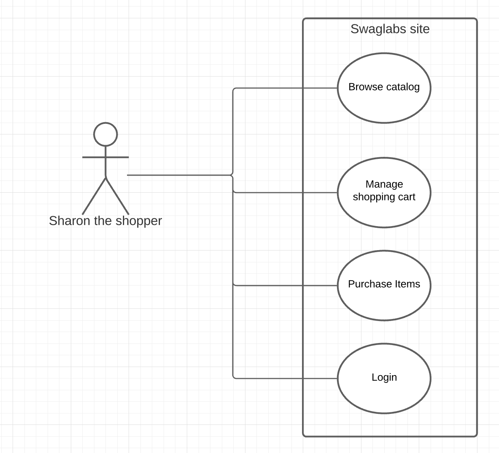

# EuroStar 2021 Cypress Tutorial

This project contains the sample Cypress exercises from the "Dip Your Toes Into Test Automation – bringing the “quality” back!" workshop held at the EuroStar 2021 conference.

Additional Resources: 
 * [Cypress Documentation](https://www.cypress.io)
 * BDD Requirements Discovery Practices:
    * [An Overview Of BDD (free video tutorial)](https://learnbdd.com/misc-494020881624795827256)
    * [Example Mapping Overview](https://cucumber.io/blog/bdd/example-mapping-introduction/)
    * [Feature Mapping Overview](https://johnfergusonsmart.com/feature-mapping-a-lightweight-requirements-discovery-practice-for-agile-teams/)
 * [Learn Example Mapping And Other BDD Practices in the _Agile Requirements Discovery Training_ course](https://learnbdd.com/sales-page-488727611622493951268)
 * [Serenity Dojo Training Library: Agile Test Automation and BDD Training, including a free course on Cypress](https://expansion.serenity-dojo.com)
