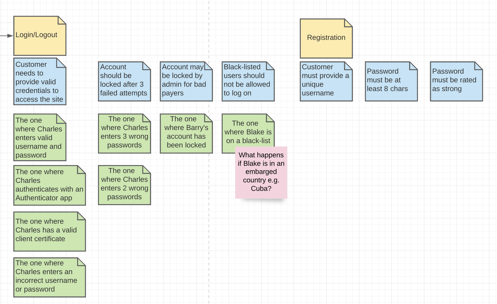
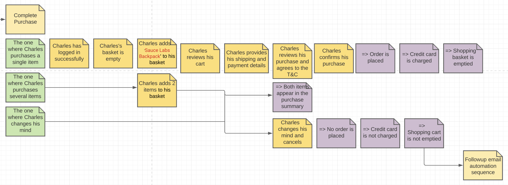

# EuroStar 2021 Cypress Tutorial

This project contains the sample Cypress exercises from the "Dip Your Toes Into Test Automation – bringing the “quality” back!" workshop held at the EuroStar 2021 conference.

The tutorial looked at the [Swag Labs](https://www.saucedemo.com) demo site, and used a BDD-style approach to analysing the site. BDD is typically used to discover and understand new features, but many BDD collaboration practices such as Impact Mapping, Example Mapping and Feature Mapping can be adapted to analyse an existing application and identify the high priority scenarios that need to be automated.

## Use Case Diagram
We start with a Use Case analysis to understand the high level capabilities that the systme provides:


## Example Mapping
We can use [Example Mapping](https://cucumber.io/blog/bdd/example-mapping-introduction/) to explore business rules and acceptance criterias, discussing examples and counter examples of these rules to expand our understanding and identify the most important scenarios to automate:



Example Mapping is a quick and effective way to organise and list the key business scenarios, including both positive and negative cases, to ensure that we are automating the scenarios that really matter to the business.

## Feature Mapping

Example Mapping is a fast, bredth-first approach that works well for many contexts. But sometimes we need to drill into the details a little more. When we want to explore user journeys, data flows or more complex business processes, such as choosing a product and completing the purchase, [Feature Maps]((https://johnfergusonsmart.com/feature-mapping-a-lightweight-requirements-discovery-practice-for-agile-teams/)) can be a good option:



Feature Mapping is another way to identify key scenarios that we need to automate, and is a good choice when looking for longer "user journey"-style scenarios.

## Automating the scenarios

In this sample project you can see these scenarios automated using Cypress. The Cypress tests are run using Mocha and generate a test report using Mochawesome. You can run the tests using 
```
npm test
```

This will run the Cypress tests in headless mode and generate a test report in the `cypress/reports/mochareports/report.html` directory:


Additional Resources: 
 * [Cypress Documentation](https://www.cypress.io)
 * BDD Requirements Discovery Practices:
    * [An Overview Of BDD (free video tutorial)](https://learnbdd.com/misc-494020881624795827256)
    * [Example Mapping Overview](https://cucumber.io/blog/bdd/example-mapping-introduction/)
    * [Feature Mapping Overview](https://johnfergusonsmart.com/feature-mapping-a-lightweight-requirements-discovery-practice-for-agile-teams/)
 * [Learn Example Mapping And Other BDD Practices in the _Agile Requirements Discovery Training_ course](https://learnbdd.com/sales-page-488727611622493951268)
 * [Serenity Dojo Training Library: Agile Test Automation and BDD Training, including a free course on Cypress](https://expansion.serenity-dojo.com)
